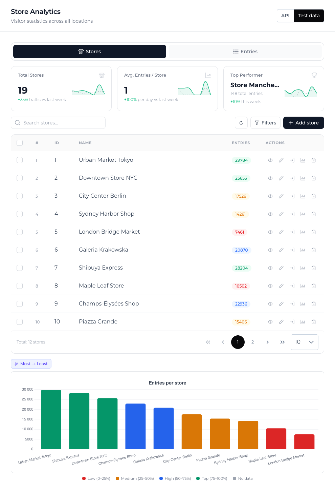
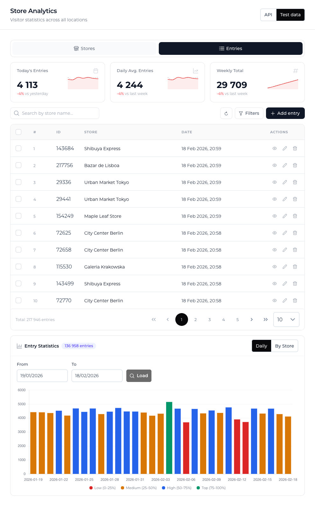
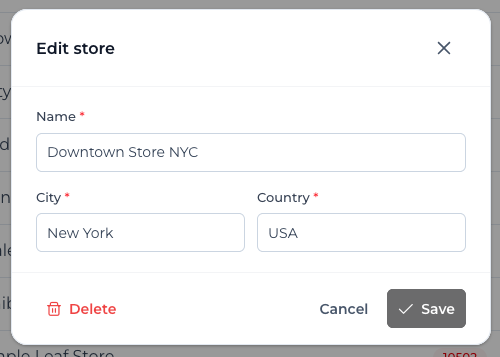
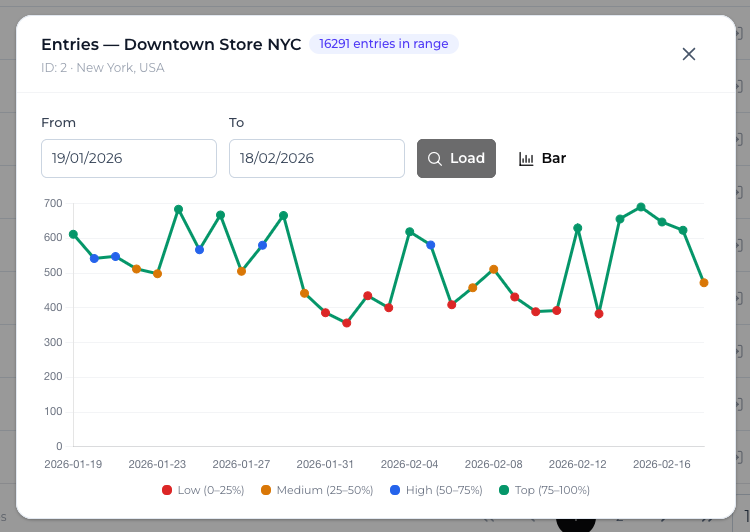
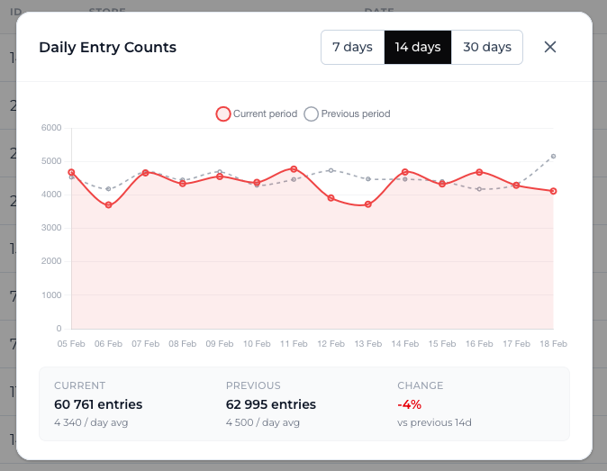

# Inhabit – Frontend Dashboard

Vue 3 + TypeScript SPA for managing store locations and tracking visitor entries. Includes charts, statistics and full CRUD.



---

## What I did myself vs. with AI assistance

### Done by me (frontend)

- Came up with the app concept, designed the UI/UX and decided on the overall layout
- Wrote all Vue components from scratch - templates, props/emits, component structure
- Designed the Pinia store architecture (state shape, actions, optimistic updates, cache)
- Integrated PrimeVue - got the DataTable working with lazy pagination, styled Dialogs via passthrough, wired up Toast notifications
- All the Tailwind styling and making things work on mobile
- Full CRUD for Stores and Entries (forms, validation, dialogs)
- Quick Stats cards with sparklines and week-over-week deltas
- Store comparison dialog, chart ↔ table hover sync, colour-coded entry badges
- Tab navigation tied to URL query params
- Set up Chart.js, vue-chartjs, date pickers and other plugins

### Where AI helped (frontend)

- **Comments & docs** - writing JSDoc for components/stores/services + inline comments for trickier parts (optimistic update flow, cache logic etc.)
- **Search debounce** - implementing the `useDebouncedSearch` composable
- **Filtering & sorting** - figuring out how to shape sort/filter params for the server and wire up the query flow
- **Folder structure** - settling on the `components/`, `composables/`, `stores/`, `services/`, `utils/`, `types/` layout
- **Chart.js config** - installing chart.js + vue-chartjs, central registration in `plugins/chartjs.ts`, tweaking chart options
- **Test data** - generating the seeded mock dataset in `testData.ts`
- **Request flow** - page caching strategy in Pinia, cache invalidation, general API request optimisation
- **Code review** - once everything worked, AI reviewed the codebase and suggested refactors (e.g. merging 4 delete dialogs into one generic component), `defineAsyncComponent` for lazy-loading, and other improvements
- **localStorage** - persisting user preferences (sort order, data source toggle)
- **Unit tests** - writing specs with Vitest + @vue/test-utils for components, stores and services
- **Form optimisation** - validation rules and error handling in form dialogs

---

## Screenshots

### Stores tab

Quick stats up top, searchable table with colour-coded entry badges, action buttons, and a bar chart underneath.


### Entries tab

Same layout idea - quick stats, table with filters (store dropdown, date range), and a statistics chart section.



### Store form dialog

Add or edit a store. Fields are validated (required, min/max length, allowed characters).



### Store entries dialog

Daily entry trend for a single store. You can change the date range and toggle between line/bar chart.



### Quick stat detail dialog

Pick a period (7/14/30 days) and see current vs previous side by side, with summary metrics.



---

## Tech Stack

| Layer            | Technology                                |
| ---------------- | ----------------------------------------- |
| Framework        | Vue 3 (Composition API, `<script setup>`) |
| Language         | TypeScript 5.9                            |
| Build tool       | Vite 7                                    |
| State management | Pinia 3                                   |
| Routing          | Vue Router 5                              |
| HTTP client      | Axios 1.13                                |
| UI components    | PrimeVue 4 + PrimeIcons 7                 |
| Styling          | Tailwind CSS 4                            |
| Charts           | Chart.js 4 + vue-chartjs 5                |
| Testing          | Vitest 4 + @vue/test-utils 2 + jsdom      |

---

## Why these packages?

| Package                    | Why                                                                                                                                    |
| -------------------------- | -------------------------------------------------------------------------------------------------------------------------------------- |
| **Vue 3**                  | Required by the task. I went with Composition API + `<script setup>` - less boilerplate and better TS support than Options API.        |
| **TypeScript**             | Catches a lot of bugs before runtime, and autocomplete makes working across 30+ files much easier.                                     |
| **Vite**                   | Basically instant HMR in dev, fast builds in prod. It's the default for new Vue projects at this point.                                |
| **Pinia**                  | Official state management for Vue 3. Much simpler than Vuex - no mutations, no getters boilerplate, works great with TS.               |
| **Vue Router**             | Needed for syncing the active tab with the URL so you can bookmark or share a direct link to the Entries tab.                          |
| **Axios**                  | I prefer it over raw `fetch` for the interceptors and cleaner error handling. Makes the API layer more readable.                       |
| **PrimeVue**               | The DataTable alone saved me a ton of work - lazy pagination, row selection, sortable columns all built in. Same for Dialog and Toast. |
| **Tailwind CSS**           | Keeps styles right next to the markup. Responsive breakpoints (`sm:`, `md:`) are quick to add, no separate CSS files to manage.        |
| **Chart.js + vue-chartjs** | Lightweight and well documented. vue-chartjs wraps charts as Vue components so they update reactively when props change.               |
| **date-fns**               | Tree-shakeable - I only import what I use, unlike Moment which bundles everything. Needed for date range calculations in stats views.  |
| **Vitest**                 | Shares the same Vite config as the app, so path aliases and TS just work. Noticeably faster than Jest.                                 |
| **@vue/test-utils**        | Official testing lib for Vue - `mount`, `shallowMount`, event simulation etc.                                                          |

---

## Project Structure

```
src/
├── components/
│   ├── common/            # ConfirmDeleteDialog, ColorLegend, SearchBar, TabNav, SectionLoader
│   ├── stores/            # StoreFormDialog, StoreDetailsDialog, AddEntryDialog,
│   │                        StoreStatisticsDialog, StoreCompareDialog, StoreQuickStats,
│   │                        StoreQuickStatDetailDialog, StoresChart, StoresToolbar
│   ├── entries/           # EntryFormDialog, EntryDetailsDialog, EntryQuickStats,
│   │                        QuickStatDetailDialog, EntryStatisticsSection, EntriesToolbar
│   ├── StoresPanel.vue    # Main stores view - table, chart, dialogs
│   └── EntriesPanel.vue   # Main entries view - table, statistics, dialogs
├── views/
│   └── DashboardView.vue  # Root layout with tab navigation and data source toggle
├── stores/                # Pinia stores
│   ├── useStoresStore.ts  # Store list, pagination cache, optimistic updates
│   ├── useEntriesStore.ts # Entry list, pagination cache, filter state
│   ├── useUserStore.ts    # Persisted preferences, API module factory
│   └── useStatisticsStore.ts # Shared date range for statistics views
├── services/
│   ├── api/               # Real API calls (storeApi.ts, entryApi.ts)
│   └── test/              # Mock API + seeded test data (testStoreApi, testEntryApi, testData)
├── composables/
│   ├── useApi.ts          # Pre-configured Axios instance
│   ├── useDebouncedSearch.ts # Search input debounce (300ms)
│   ├── useStoreDialogs.ts # Store dialog state, openers, transitions, event handlers
│   └── useEntryDialogs.ts # Entry dialog state, openers, event handlers
├── plugins/
│   └── chartjs.ts         # Centralised Chart.js component registration
├── utils/                 # Pure helper functions (chart, date, dialog, format)
├── types/                 # TypeScript interfaces (api, store, entry, statistics)
└── router/
    └── index.ts
tests/
├── components/            # SearchBar.spec.ts, TabNav.spec.ts
├── services/              # testStoreApi.spec.ts, testEntryApi.spec.ts
└── stores/                # useStoresStore.spec.ts, useUserStore.spec.ts
```

---

## Getting Started

```bash
npm install
npm run dev        # development server at http://localhost:5173
npm run build      # production build
npx vitest run     # run unit tests (Vitest)
```

> The dev server proxies `/api/*` to `http://localhost:5113` (the .NET backend).
> If the backend isn't running, flip the **Test Data** toggle in the dashboard header - the app will use a built-in mock API instead.

---

## Implemented - per task requirements

### Charts

Bar and line charts (Chart.js via vue-chartjs) show:

- entry counts per store (bar chart under the stores table)
- daily entry trend (line/bar in StoreStatisticsDialog and EntryStatisticsSection)
- per-store breakdown (doughnut chart in EntryStatisticsSection "By Store" view)

### Configurable date range

All statistics views default to the last 30 days but let you pick any range via date pickers. The range is shared across views through `useStatisticsStore` and saved to `localStorage`.

### Vue 3

Everything is built with Composition API and `<script setup>`.

### Unit tests

6 spec files covering components, Pinia stores and mock API services.

---

## Extra stuff I added

| What                      | Details                                                                                                     |
| ------------------------- | ----------------------------------------------------------------------------------------------------------- |
| **Test Data mode**        | Toggle in the header switches the whole app between the real API and a mock layer - works without a backend |
| **Full Store CRUD**       | Create, view, edit and delete stores through dedicated dialogs                                              |
| **Full Entry CRUD**       | Create, view, edit and delete entries with store picker and date-time selector                              |
| **Bulk delete**           | Select multiple rows in either table and delete them in one go                                              |
| **Page cache**            | Pinia stores keep fetched pages in a `Map` so going back a page doesn't re-fetch                            |
| **Optimistic updates**    | Creates/edits/deletes show up in the table instantly, without waiting for the server                        |
| **Debounced search**      | 300ms debounce before firing an API request                                                                 |
| **Entry filters**         | Filter entries by store (dropdown) and date range, on top of text search                                    |
| **Quick Stats**           | Summary cards with sparklines and week-over-week % change above each table                                  |
| **Stat detail dialogs**   | Click a stat card → period comparison (7/14/30d) with current vs previous overlay                           |
| **Store comparison**      | Select 2+ stores → side-by-side statistics chart                                                            |
| **Chart ↔ table sync**    | Hover a bar in the chart and the matching table row highlights (and the other way around)                   |
| **Colour-coded entries**  | Store rows use a red→amber→blue→green gradient based on relative entry volume                               |
| **Saved preferences**     | Sort field, sort order, chart sort, data source - all persisted to `localStorage`                           |
| **Shared date range**     | Statistics date range synced across views via a dedicated Pinia store                                       |
| **Responsive**            | All views, toolbars, dialogs and tables work on mobile                                                      |
| **Lazy-loaded charts**    | Chart-heavy dialogs use `defineAsyncComponent` to keep the initial bundle smaller                           |
| **Generic delete dialog** | One reusable `ConfirmDeleteDialog` component for both stores and entries                                    |
| **Full TypeScript**       | Every file is typed, shared interfaces used across components, stores and services                          |
